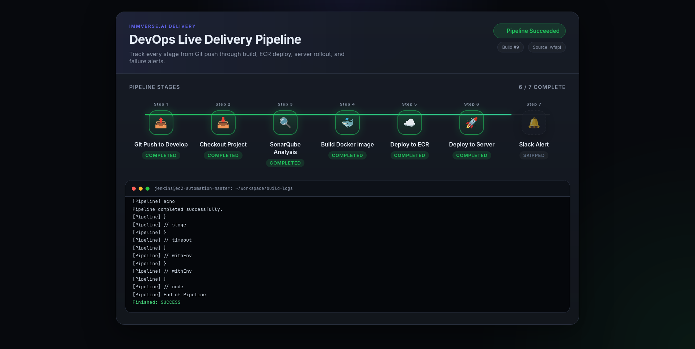
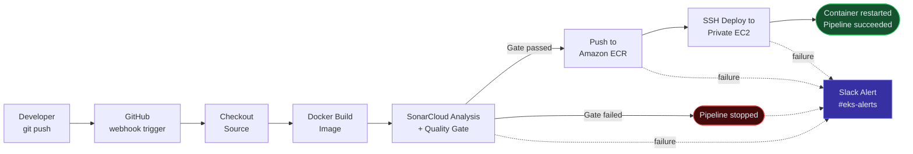
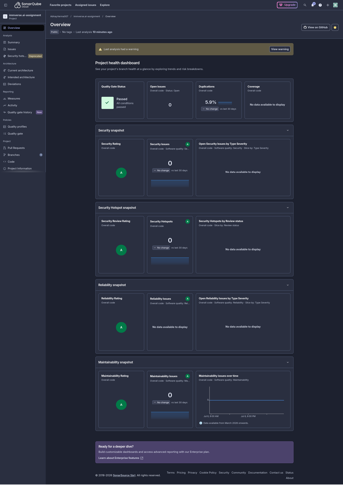
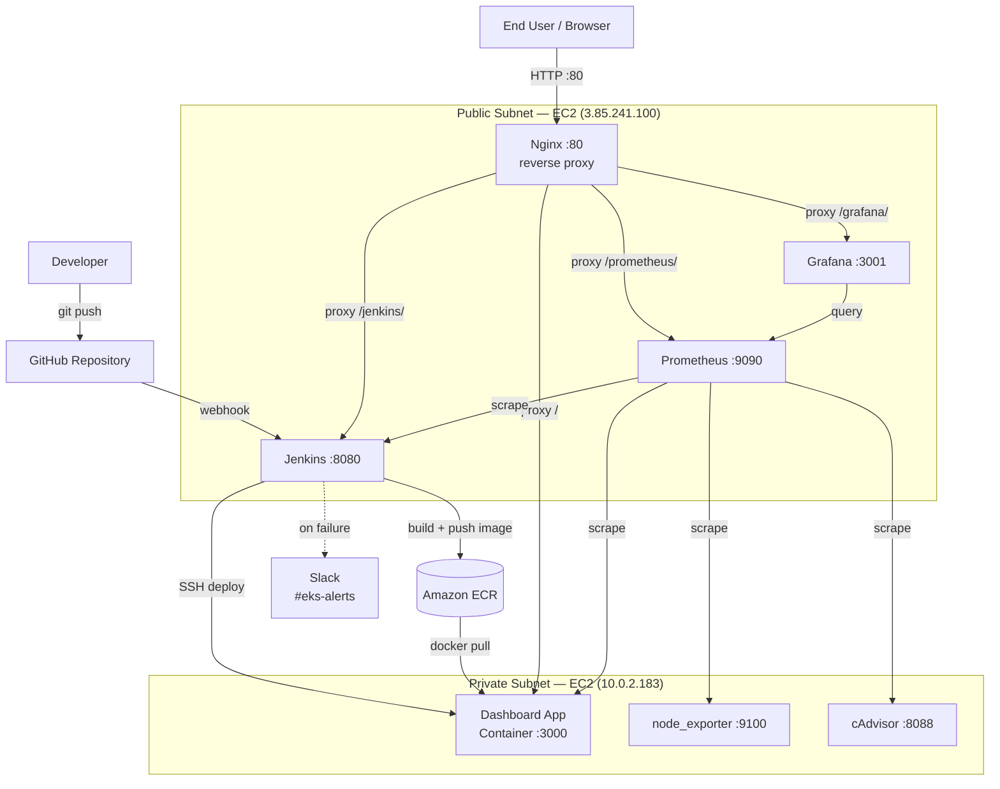
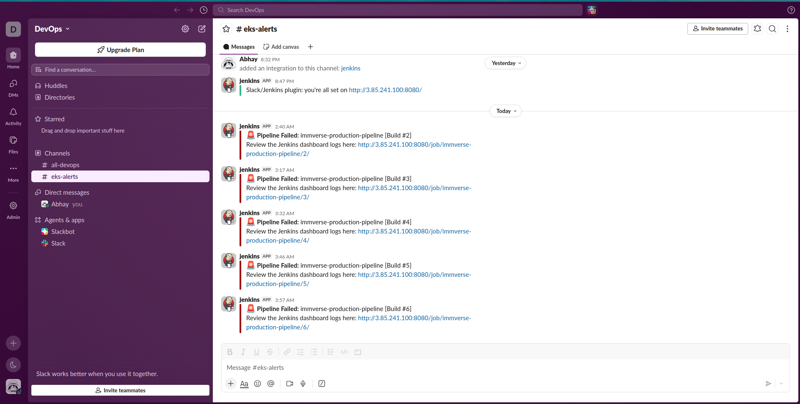
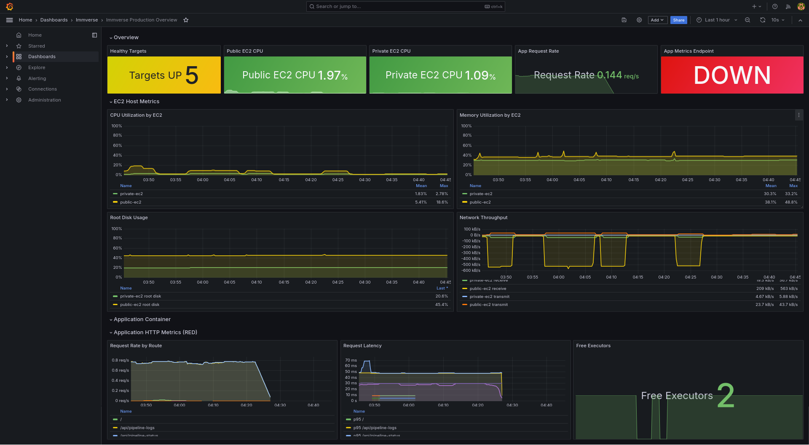

# 🚀 immverse.ai — DevOps CI/CD Assignment

An end-to-end CI/CD pipeline that builds, scans, and ships a containerized Node.js app to a private EC2 instance — with a live dashboard that shows every pipeline stage in real time, full Prometheus/Grafana observability, and Slack alerts on failure.

> 🟢 **Live dashboard:** `http://3.85.241.100/` — polls Jenkins directly, so what you see reflects the actual state of the last build, not a mock.



---

## 📖 Table of Contents

- [What This Is](#what-this-is)
- [CI/CD Pipeline Flow](#cicd-pipeline-flow)
- [Deployment Architecture](#deployment-architecture)
- [Repository Structure](#repository-structure)
- [Component Breakdown](#component-breakdown)
- [Live Pipeline Dashboard](#live-pipeline-dashboard)
- [Slack Alerting](#slack-alerting)
- [Monitoring Stack](#monitoring-stack)
- [Environment Variables](#environment-variables)
- [Running Locally](#running-locally)
- [No Domain Name — How Access Works](#no-domain-name--how-access-works)
- [Further Optimizations for Production](#further-optimizations-for-production)

---

## What This Is

Every push to `main` triggers Jenkins to build a Docker image, run a SonarCloud static analysis/security scan with a hard quality gate, push the image to a private Amazon ECR repository, and deploy it via SSH to an EC2 instance sitting in a private subnet — with no public IP of its own. A public-facing EC2 instance runs Jenkins, Nginx (reverse-proxying everything), and the Prometheus/Grafana monitoring stack. If any stage fails, a Slack alert fires immediately with a direct link to the failed build.

## 🔄 CI/CD Pipeline Flow



This mirrors the actual `Jenkinsfile` stage names 1:1 — `Checkout Source` → `Docker Build Image` → `SonarQube Analysis & Quality Gate` → `Push to ECR Registry` → `Deploy to Private EC2` — with the `post { failure }` block firing the Slack notification regardless of which stage broke.



## 🏗️ Deployment Architecture



**Why split public/private subnets?** The app container never gets a public IP or security group opening directly to the internet — the only way in is through Nginx on the public box, and the only way Jenkins reaches it is over SSH for deploys. This mirrors how a real production app tier would be isolated behind a bastion/edge layer, rather than exposing the app instance directly.

## 📂 Repository Structure

```
immverse.ai-assignment/
├── Jenkinsfile                     # Declarative pipeline: build, scan, push, deploy, alert
├── app/                             # The dashboard application
│   ├── app.js                       # Express server + live Jenkins status polling
│   ├── package.json / package-lock.json
│   ├── Dockerfile                   # Non-root (node) production image
│   └── public/
│       └── index.html               # Live pipeline dashboard UI (see screenshot above)
├── monitoring/                      # Prometheus + Grafana stack
│   ├── docker-compose.yml           # Runs on the public EC2 alongside Jenkins/Nginx
│   ├── prometheus/
│   │   └── prometheus.yml           # Scrape configs for both EC2 instances + app + Jenkins
│   ├── grafana/
│   │   ├── provisioning/            # Auto-provisioned datasource + dashboard config
│   │   └── dashboards/               # immverse-production.json — the production dashboard
│   └── scripts/
│       ├── install-exporters.sh     # Bootstraps node_exporter + cAdvisor on any EC2 host
│       └── deploy-monitoring.sh      # Brings up the monitoring stack, verifies targets
├── nginx/                           # Reverse proxy configuration for the public EC2
│   ├── nginx.conf                    # Base Nginx config (rate limiting, gzip, includes)
│   └── sites-available                # Active vhost: routes /, /jenkins/, /grafana/, /prometheus/
├── working-screenshots/              # Proof-of-work screenshots (dashboard, Grafana)
└── README.md
```

## Component Breakdown

| Component | Role | Key resources |
|---|---|---|
| **Jenkinsfile** | Defines the entire pipeline as code | 5 stages + `post` block; credentials bound via `withCredentials`/`sshagent`, never hardcoded |
| **app/app.js** | Live pipeline dashboard backend | Polls Jenkins `wfapi`/`api/json`, falls back to console-log parsing if the workflow API is unavailable |
| **app/public/index.html** | Dashboard frontend | Renders the 7-step pipeline visual (Git push → Slack alert), auto-refreshes against `/api/pipeline-status` |
| **app/Dockerfile** | Container build | `node:24-alpine`, runs as non-root `node` user, production-only dependencies |
| **monitoring/** | Observability stack | Prometheus scrapes both EC2 hosts, cAdvisor, node_exporter, and Jenkins itself; Grafana visualizes it all behind `/grafana/` |
| **nginx/** | Single public entry point | One EC2 with a public IP fronts Jenkins, the app, Prometheus, and Grafana — nothing else is directly exposed |
| **Slack integration** | Failure alerting | Fires on any pipeline failure, posts directly to `#eks-alerts` with a build link |

## Live Pipeline Dashboard

The dashboard isn't a static mockup — `/api/pipeline-status` calls the real Jenkins API for the last build, so the stage grid, the `Build #` badge, and the `Source: wfapi` tag in the screenshot above are all live data. If Jenkins' workflow API is temporarily unavailable, the backend transparently falls back to parsing the raw console log to reconstruct stage status, so the dashboard degrades gracefully instead of going blank.

## 🔔 Slack Alerting

The `post { failure }` block in the `Jenkinsfile` sends a message to `#eks-alerts` on **any** stage failure — build, scan, push, or deploy — with the job name, build number, and a direct link to the Jenkins console log:

```groovy
slackSend(
    color: 'danger',
    channel: '#eks-alerts',
    tokenCredentialId: 'slack-token',
    message: "🚨 *Pipeline Failed:* ${env.JOB_NAME} [Build #${env.BUILD_NUMBER}]\nReview the Jenkins dashboard logs here: ${env.BUILD_URL}"
)
```


This means failures are surfaced immediately without anyone needing to be watching the Jenkins UI.

## 📈 Monitoring Stack

Prometheus and Grafana run as containers on the public EC2 (`monitoring/docker-compose.yml`), scraping:

- **Both EC2 hosts** via `node_exporter` (CPU, memory, disk)
- **Both hosts' containers** via `cAdvisor`
- **Jenkins** itself, via its built-in `/prometheus/` metrics endpoint
- **The app**, via a configured `immverse-app` scrape job

Grafana is provisioned automatically on startup (datasource + `immverse-production` dashboard), reachable at `/grafana/` through the same Nginx entry point — no separate login flow or extra exposed port needed.



## Environment Variables

Set at deploy time by the Jenkinsfile's `Deploy to Private EC2` stage — not committed anywhere in this repo:

| Variable | Purpose |
|---|---|
| `JENKINS_URL` | Base URL the dashboard polls for build status |
| `JENKINS_USER` / `JENKINS_TOKEN` | Read-scoped Jenkins API credentials |
| `JOB_NAME` | The Jenkins job whose last build is displayed |

## Running Locally

```bash
cd app
npm install
npm start
# visit http://localhost:3000
```

Without `JENKINS_URL`/`JENKINS_TOKEN` set, the dashboard will log a warning and the status endpoint will return an error payload with placeholder stage data — the UI still renders, it just won't reflect a real build.

## No Domain Name — How Access Works

This project intentionally has no purchased domain. The public EC2's Elastic IP (`3.85.241.100`) is the single entry point, and Nginx routes every service through path-based proxying rather than subdomains — which avoids needing DNS at all. If HTTPS is needed later, a free wildcard service like `nip.io` combined with Let's Encrypt would get a valid certificate issued against this same IP without ever buying a domain.

## 🔮 Further Optimizations for Production

This assignment intentionally favors clarity and a working end-to-end flow over production hardening. Given more time, the next priorities would be:

- **Consolidate the Nginx configs** — `immverse-public.conf`, `grafana.conf`, and `sites-available` currently have overlapping `/grafana/` and `/prometheus/` blocks; only one should be the source of truth.
- **Zero-downtime deploys** — the current deploy stage does `docker stop` → `docker rm` → `docker run`, which has a brief window where the app is unreachable. A blue-green swap (spin up the new container on a different port, health-check it, then flip Nginx's `proxy_pass`) would remove that gap entirely.
- **Move from SSH-based deploys to an IAM instance role + `aws ecr` pull-only policy on the private EC2**, removing the need to pass long-lived credentials over SSH at all.
- **Add automated rollback** — if the health check after deploy fails, automatically redeploy the previous known-good image tag rather than leaving a broken container running.
- **Horizontal scale path** — document (or implement) how this would extend to an Auto Scaling Group + Application Load Balancer instead of a single private instance, for when a single EC2 box is no longer enough.
- **Add Prometheus alerting rules** (not just dashboards) so on-call gets paged on real threshold breaches (CPU, memory, container restarts), not just pipeline failures.immverse.ai — DevOps CI/CD Assignment

An end-to-end CI/CD pipeline that builds, scans, and ships a containerized Node.js app to a private EC2 instance — with a live dashboard that shows every pipeline stage in real time, full Prometheus/Grafana observability, and Slack alerts on failure.


🌐 Live dashboard: http://3.85.241.100/ — polls Jenkins directly, so what you see reflects the actual state of the last build, not a mock.